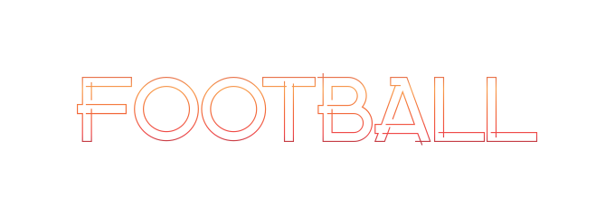

# Football - The New fork of C.F.

## About FootballDex and CarFigures

**CarFigures (CF)** was born a long time ago by Array, Initially, He had no particular liking for the idea; it was more about a response to dissatisfaction. The BallsDex team wasn't keen on implementing features that many of us wanted. I knew that merely complaining wouldn't lead to any change, as hundreds of others had already done so to no avail.

Determined to make a difference, He decided to take matters into his own hands. By forking BallsDex and applying my own changes and preferences, CarFigures came into existence.

CarFigures aims to address the community's frustrations and provide an alternative base to use and build their bots on. It's a project driven by a desire for improvement and a commitment to providing a better user experience.

**FootballDex (FBD)** was inherited from CarFigures, It was previously a Chips-Based bot, And it was called Chipsdex, After it was born, It was settled that Chipsdex was a complete failure; a lot of people didn't have fun while using Chipsdex, It was amusing for them that Chipsdex was a failure; So I decided to create a dex based on one of the most famous sport in the world, **FootballDex.**
## Installation
### Requirements
Before the Installation, Make sure to have the following things:

- Git | Used for cloning and managing the project repository, and also updating your bot to the latest versions too. | [https://git-scm.com/downloads](https://git-scm.com/downloads) 
- Docker Desktop | Provides an easy way to run your bot in isolated containers, Only for Windows Users | [https://www.docker.com/products/docker-desktop](https://www.docker.com/products/docker-desktop)
- Docker Engine | Same as Docker Desktop, Only works in Linux and Highly Recommended for Linux Users | [https://docs.docker.com/engine/install](https://docs.docker.com/engine/install/)
- Discord bot Instance | Required to create and manage your bot on Discord. | [https://discord.com/developers/applications](https://discord.com/developers/applications)

### Installing
Now once you install all of those, Let's start!

1. Create a Github or CodeBerg account if you are new to Github or CodeBerg.
2. Fork Carfigures code [from here](https://codeberg.org/array_ye/CarFigures/fork) or [here](https://github.com/arrayunderscore/CarFigures/fork) 
3. For Linux Users, Go to the folder you want to put the bot files in, And right click on the empty space and then click on "Open in Terminal". 
4. For Windows Users, Go to the folder you want to put the bot files in, And click on the folder directory thing in the Middle-Top of Windows Explorer, Select all the text and replace it with cmd.exe, That will open Command Prompt for you.
5. Download the settings.toml file [from here](https://drive.usercontent.google.com/download?id=1ZMm3zRS__UC7QOzGGN4ZyxmjnhLbp1sl&export=download&authuser=0) and drag it to your bot folder, Now your bot folder should look something like this (2*) 
6. Change the Folder name from "CarFigures" to the name of your dex/figures bot to make it easier for you in docker to know which dex is it.

> 1* - This will make you responsible for maintaining your own fork of CF, if you are not interested in that and just want to make a bot, then just git clone the carfigures repo, as you can see it in the third step.\
> 2* - The settings.toml isn't updated by default when updating the bot files, you are required to check if any changes happened to the toml file by yourself, i will update the link of download every-time a new update for it gets released, its your responsibility.
 
## Post-Installation

Once you have completed the installation and configuration steps, its time to configure and make the bot look the way you like it to be!

### Configuration file
Remember the settings.toml we just downloaded? That's the configuration file!

### Starting up
After configuring and editing the settings.toml file, now its time to start the bot instance and play with it!
Start by getting docker desktop up and running, then open your file explorer and head to the bot files.

After opening the terminal or command prompt, you shall be greeted with something like this.

Now its time for you to build the project image (The image the contains your database which stores all your bot's progress, the code and more) using `docker compose build`

And now, its time to start up your bot!\
Using `docker compose up` will make the docker starts all the containers and functions to start making connections to the discord's apis, allowing the bot to be alive!
and after doing it, the final results should be like this, with the end line saying "(your bot name) is now operational!"

That's it! You are all set to rock and roll with CarFigures!\
If you run into any trouble along the way, don't hesitate to reach out for help. We're here to make sure you have a smooth ride.

## Contributing to CarFigures!

Here's how you can jump in and help make this project even better:

### How to Contribute

1. Fork the repository to your Codeberg account.
2. Create a new branch for your feature or bug fix: `git checkout -b new-feature`
3. Make your changes and commit them with cool and descriptive messages: `git commit -m 'Add new feature'`
4. Push your changes to your branch: `git push origin new-feature`
5. Open a pull request (PR) against the `stable` branch of the original repository.

### Pull Request (PR) Guidelines

To make sure your PR can be checked out and merged smoothly, please follow these guidelines:

- Clearly describe the purpose of the PR and the changes made.
- Provide tests and documentation for any new features or changes in functionality, this is a good practice too to always debug your code before pushing them.
- If possible, include screenshots showing before/after states of any visual changes.
- Ensure that all existing tests pass without failure.
- Make sure your code follows the project's coding standards and vibes.
- Go with the least amount of line changes and commits as possible.

### Code of Conduct
Everyone who contributes is expected to stick to the [Code of Conduct](./assets/CODE_OF_CONDUCT.md) when getting involved with the project and its community members.

### Help and Feedback

If you need help, have questions, or want to share your thoughts, Don't hesitate to open an issue or ask about it in the dev category inside the CarFigures Discord server.

 - You will need a forker role inside the server to have access to the dev category, so inform Youssif Elsayed first so he can give you the role
## Roadmap and Future Plans
People are excited about the future of CarFigures and all its forks! Here are some features and improvements Youssif Elsayed has planned:

### Upcoming Features for Carfigures:

- Economy and Modifying Packages.
- Server/Player Settings Embed
- Leaderboard Embed + Controls
- Crafting Commands | Customizable Through The Admin Panel
- Racing/Battling Package

### Future Plans for Carfigures:

- Switch from fastapi_admin to our own tech-stack.
- Implement a premium plan inside CF.
- Combine some existing commands into one (e.g., /user privacy and /user donation policy into /user settings)
